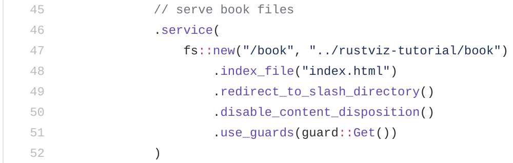

# fplab.eecs.umich.edu

This server is built with [Actix](https://actix.rs/), Rust's powerful web framework.

The database is built on [SQLite](https://www.sqlite.org/index.html), a small, fast, self-contained, high-reliability, SQL database engine.

This repo has enabled release profiles to allow build optimizations. To run simply execute:

```bash
cargo build --release
cargo run --release
```

## Design
+ Quiz answers will be submitted via a POST request to `/submit` and will be kept hidden from users.
+ Users will be tracked with session cookies

| Route                | Method    | Purpose  |
| -------------------- | :-------: | -------- |
| `/rust-tutorial`     | GET       |  Renders index page                   |
| `/fp`                | GET       |  Serve quiz-related, dynamic files    |
| `/book`              | GET       |  Serve static Rust-lang book files    |
| `/submit `           | POST      |  Submit response to questions or update time stats<br>Params: `ques_id`, `ans_id`, `free_response`, `time_elapsed_question`, `time_elapsed_hover`<br>Note: `ans_id` and `free_response` are optional parameters. |
| `/question/`         | GET       |  Retrieve user's quiz progress information<br>Returns `total`, `current`, `curr_ans_vec`, `saved_free_res`, `url` in JSON format |
| `/question/{qid}/`   | GET       |  Retrieve question information<br>Returns `qid`, `filename` `prompt`, `choices`, `contains_free_response` in JSON format |
| `/accounts/login/`   | GET, POST |  Create session cookies to track current user<br>Note: Cookie expires in one (1) week from time of creation |
| `/accounts/logout/`  | POST      |  Remove session cookies, forget current user's identity<br>Note: User info remains in DB |
| `/accounts/create/`  | GET, POST |  Insert user info into DB and create session cookies to track current user's identity |

---

## Initialization

### 1. Create the SQLite database.

```bash
mkdir db
touch db/fp.sqlite3
```

### 2. Declare default data in the database. This can be done by modifying `sql/data.sql`.

> Note: For EECS 490 Instructors, use this python script to create sql/data.sql: https://github.com/rustviz/490w21-sql

> Note: Data is entered as ordered tuples.

| Table | Command | Notes |
| ----- | :------ | :---- |
| users | `INSERT INTO users(token)`<br>`VALUES ('<token>');` | Requires unique tokens, one for each user/student |
| questions | `INSERT INTO questions (question_id, answer, filename, prompt)`<br>`VALUES (<u8>, <u8>, <String>, <String>);` | Filenames should match the respective images in the `/docs` folder containing the SVGs<br>Optional field: `contains_fr` : `<u8>` (1 if question requires free response, 0 otherwise) |
| choices | `INSERT INTO choices (question_id, ans_id, choice_text)`<br>`VALUES (<u8>,<u8>, <String>);` | `question_id`: The question to which this multiple choice answer belongs to.<br>`ans_id`: A unique id given to each answer in the range [0..n].<br>`choice_text`: The text to be display as a clickable choice in the quiz.|

Example commands:
```sql
INSERT INTO users(token)
VALUES ('a45ffdcc71884853a2cba9e6bc55e812');

# Question 2: Correct answer id is 3. Respective SVGs are docs/vis_04_01_01_code.svg and docs/vis_04_01_01_timeline_svg
INSERT INTO questions (question_id, answer, filename, prompt) # optional: contains_fr
VALUES (2, 3, 'vis_04_01_01', 'What value is stored in x?');

# This multiple choice answer belongs to question 0. Its answer id is 1.
# The text to be displayed is 'x = 5'.
INSERT INTO choices (question_id, ans_id, choice_text)
VALUES (5, 0, 'vis_04_01_01', 'x = 5');
```

### 3. Copy default data into the database.

```bash
./bin/fpdb create
```

### 4. Create the static site for the tutorial
The tutorial is a static webpage. For Fall 2020, we used an mdbook with RustViz visualizations integrated in it, located [here](https://github.com/rustviz/rustviz-tutorial). You need access to the rustviz GitHub org to access this. However, however, any static site can be used.

Make sure that `main.rs` is set to point to the correct location of the static site. Here is a screenshot of where that is is `main.rs`.


### 5. Build the rust-line-editor-ui client for the EECS 490 Rust assignment
```
cd rust-line-editor/public/rust-src
docker build --tag rust-src .
```
```
cd rust-line-editor-ui
npm ci
yarn build
```

### 5. Add the solution for the rust-line-editor-ui assignment
found here: https://github.com/rustviz/490w21-sql

Add to this path: fplab-server/rust-line-editor-ui/public/rust-src/src/solutions.rs

### 6. Build and execute module.

> Note: Might require `sudo` before commands.
```bash
cargo build --release
cargo run --release
```
To run the server detached (so you can close your shell), use:
```
nohup cargo run --release &
```
This command will output the process id. Use this command to shut down the server:
```
kill -9 <pid>
```
In case you don't know the pid, you can see which process is using a particular port by running:
```
lsof -i :<port>
```

### 7. Exporting student answers
To export student quiz answers to a CSV, open the database with sqlite3 and do the following:
```
sqlite> .headers on
sqlite> .mode csv
sqlite> .output test.csv
sqlite> select * from responses;
sqlite> .output stdout
```
and for assignment scores do the following:
```
sqlite> .headers on
sqlite> .mode csv
sqlite> .output test.csv
sqlite> select token, COUNT(*) from scores WHERE score = 1 GROUP BY token;
sqlite> .output stdout
```
and for assignment answers (state of student's rust file) do the following:
```
sqlite> .headers on
sqlite> .mode csv
sqlite> .output test.csv
sqlite> select token, edit_state from edit_states GROUP BY token;
sqlite> .output stdout
```

### 8. Periodically backing up the database
You can create the a backup of the database with the following script:
```
./bin/backup
```

Consider having periodic backups of the database. During W21 we used cron to run this script every hour.


### 9. Getting it into Gradescope
Getting these csv-formatted responses into Gradescope is kinda tricky. If the "online assignment" functionality in Gradescope is sufficient, I highly reccommend using that for ease of grading. Here are some pointers on how I managed to get this into gradescope. There might be an easier way to do this.
- I created two assignments in Gradescope, one for the multiple choice and one for free response.
- I used the pandas python library to read the CSV files into a dataframe and transform the data as needed
- For the multiple choice, I created it as a programming assignment on Gradescope and then created an [autograder](https://github.com/eecs490/simple-mcq-autograder) that just looks at a submitted text file and checks if the answers in that text file matches what is expected. I then programatically generated a text file for each student's multiple choice responses and used [gradescope.py](https://github.com/eecs490/exercise-repo/tree/master/tools) to submit them to the autograder for grading. 
 - For the free response, I created it as an exam in Gradescope so I could upload one big pdf file and split the pdf file into multiple student submissions. I then programmatically created a pdf file with the student free responses. One useful thing here is to add the student emails to this pdf as well as use Gradescope's functionality to automatically split the pdf and match the responses to the corresponding student. 
## Issues

All open, unresolved issues and current challenges can be found under ["Issues"](https://github.com/fplab/fplab-server/issues).
